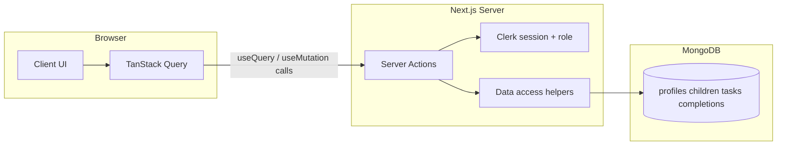

# Kid routine todos — implementation plan

## Current state

- [package.json](package.json): Next **16.2.1**, React 19, Tailwind 4. No DB, no auth.
- [app/page.tsx](app/page.tsx): default template only.

Follow [Next.js App Router](https://nextjs.org/docs/app) docs for **Server Actions** (`"use server"`). Check `node_modules/next/dist/docs/` when present for Next 16 specifics.

## Architecture (high level)

**Client data and mutations (required):** Use **[TanStack React Query](https://tanstack.com/query/latest)** (`@tanstack/react-query`) for **all** client-side **loading, caching, refetching, and mutations**. Do **not** fetch app data ad hoc in `useEffect` or pass initial lists only from RSC without Query unless the surface is purely static.

- `**useQuery`**: `queryFn` must **only** call a **Server Action** (or a thin wrapper whose sole job is to invoke that action). No direct `fetch` to internal APIs for app data unless you later add a dedicated route — default is **actions only**.
- `**useMutation`**: `mutationFn` calls Server Actions; on success use `**queryClient.invalidateQueries`** (and/or `**setQueryData**` for optimistic updates) so the UI stays consistent.
- **Serializable returns**: Server Actions return **plain JSON-safe** DTOs (dates as ISO strings if needed). No class instances or Mongo `ObjectId` in responses without mapping to strings.

**Server Actions and database:** Every Server Action uses the same `**lib/data/*`** helpers after `**auth()`** / `**currentUser()`** from `@clerk/nextjs/server`. **Reads** are exposed as dedicated “query” actions (e.g. `getDashboardData`, `getProfile`) so React Query stays the single client orchestration layer. `**revalidatePath`** is optional; prefer **query invalidation** as the primary refresh mechanism for client-driven pages.

## Dependencies and configuration

- **MongoDB**: Official `[mongodb](https://www.npmjs.com/package/mongodb)` driver — recommend **native driver + TypeScript types** unless you prefer Mongoose.
- **Auth**: **[Clerk](https://clerk.com/docs/nextjs/getting-started/quickstart)** — `@clerk/nextjs`, `**proxy.ts`** with `**clerkMiddleware()`**, `**ClerkProvider`** in `app/layout.tsx`, `**auth()**` / `**currentUser()**` from `@clerk/nextjs/server`. UI: `**<Show>**`, `**<UserButton>**`, sign-in/sign-up per current Clerk docs.
- **Roles**: Clerk `**publicMetadata.role`**: `"user"`  `"admin"`; missing → `"user"`. Admins set in [Clerk Dashboard](https://dashboard.clerk.com/) or Backend API.
- **React Query**: `@tanstack/react-query`. Optional: `@tanstack/react-query-devtools` in development.
- **Env**: `MONGODB_URI`, `NEXT_PUBLIC_CLERK_PUBLISHABLE_KEY`, `CLERK_SECRET_KEY`.

Mongo connection: [singleton pattern](https://github.com/vercel/next.js/tree/canary/examples/with-mongodb) for serverless.

## Data model (collections)

| Collection    | Purpose                                                                                                                                      |
| ------------- | -------------------------------------------------------------------------------------------------------------------------------------------- |
| `profiles`    | `_id`, `**clerkId`** (unique), `timezone` (IANA), optional default morning/evening windows. Identity + `**role`** in Clerk `publicMetadata`. |
| `children`    | `_id`, `userId` (Clerk user id), `name`, `sortOrder`, optional per-child window overrides; use owner profile `timezone` for calendar dates.  |
| `tasks`       | `_id`, `childId`, `userId` (denormalized), `title`, `routine` (`morning`                                                                     |
| `completions` | `_id`, `childId`, `taskId`, `userId`, `date` (`YYYY-MM-DD`), `completedAt`. Unique `(taskId, date)`.                                         |

**Profile bootstrap:** Upsert `profiles` for `currentUser().id` on first need (action or dedicated `ensureProfile`).

**Indexes:** unique `profiles.clerkId`; `children.userId`, `tasks.childId`, `tasks.userId`; `completions` by `(childId, date)`; unique `(taskId, date)`.

## Authorization rules

Centralize in `lib/authz.ts`:

- `**user`**: Scope to `userId ===` Clerk `userId` for children/tasks/completions/profile.
- `**admin`**: `publicMetadata.role === "admin"` — full read/write across users in admin UI.

## Server Actions (by feature)

Group under `app/actions/` (or per-route `actions.ts`) with `"use server"`.

**Read actions (called from `useQuery`):**

- `getProfile()` / `getDashboardData(filters?)` — bundle children, tasks, completions for “today”, profile timezone/windows for one round trip where practical.
- `getAdminOverview()` — admin-only aggregated users/children/tasks.

**Write actions (called from `useMutation`):**

- `ensureProfile()` if not folded into first read.
- Children: `createChild`, `updateChild`, `deleteChild`, `reorderChildren`.
- Tasks: `createTask`, `updateTask`, `deleteTask`, `reorderTasks`.
- Completions: `toggleTaskCompletion(childId, taskId)`.
- Settings: `updateTimezone`, `updateRoutineWindows` (profile and/or per-child).

**React Query integration:** Define a small `**queryKeys`** object (e.g. `['dashboard']`, `['profile']`, `['admin']`). Mutations `**invalidateQueries`** for affected keys (narrow keys when possible). Use `**staleTime`** on stable bundles if you want fewer round trips; keep toggles feeling instant with `**setQueryData**` or optimistic updates optional.

## UI / routes

| Route                   | Role           | Behavior                                                                                                                                      |
| ----------------------- | -------------- | --------------------------------------------------------------------------------------------------------------------------------------------- |
| Clerk sign-in / sign-up | guest          | Hosted or embedded Clerk                                                                                                                      |
| `/dashboard`            | signed-in user | Client page/sections: **React Query** loads dashboard via `**getDashboardData`**; task buttons use `**useMutation`** → `toggleTaskCompletion` |
| `/settings`             | user           | Forms mutate via `**useMutation**`; profile query invalidated                                                                                 |
| `/admin`                | admin          | `**useQuery**` → `getAdminOverview`; mutations invalidate admin + any nested keys                                                             |

**Dashboard:** Large task buttons; incomplete vs complete (today) styling. Routine filter: Morning  Evening  All; optional auto filter from profile windows + current time.

**Providers:** Client component e.g. `app/providers.tsx`: `**QueryClientProvider`** (create `QueryClient` with `useState` to avoid sharing across users in SSR). Wrap inside `**ClerkProvider`** tree as needed (Clerk in root `layout`, Query provider can be sibling under `body` or inside Clerk).

## Route protection (Clerk)

- `**proxy.ts`**: `**clerkMiddleware()**` + `matcher` per [Clerk quickstart](https://clerk.com/docs/nextjs/getting-started/quickstart). Protect `/dashboard`, `/settings`, `/admin`.
- `**/admin**`: Require `**publicMetadata.role === "admin"**` in layout or middleware.

## First admin

Set `**publicMetadata.role**` to `"admin"` in Clerk Dashboard or API; document in `.env.local.example` comments.

## Files to add / change (concrete)

- **New**: `lib/mongodb.ts`, `lib/authz.ts`, `lib/types.ts` (or Zod), `lib/data/*.ts`, `lib/query-keys.ts`.
- **New**: `app/actions/*.ts` — read + write server actions returning DTOs.
- **New**: `proxy.ts` (Clerk), `app/providers.tsx` (QueryClientProvider), hooks under `lib/hooks/` or colocated `use-dashboard.ts` etc.
- **New**: `app/(dashboard)/...` client components that use `useQuery` / `useMutation`.
- **Update**: [app/layout.tsx](app/layout.tsx) — ClerkProvider, Providers wrapper, metadata.
- **New**: `.env.local.example` — Mongo + Clerk keys.

## Testing / verification

- Manual: two Clerk users, isolated data; admin sees all; React Query refetches after mutations (network tab or DevTools).
- Optional: Query test utilities later.

## Risk / product choices (defaults assumed)

- Calendar `**YYYY-MM-DD`** in **profile timezone**.
- Clerk handles OAuth/email; enable in Dashboard as needed.

